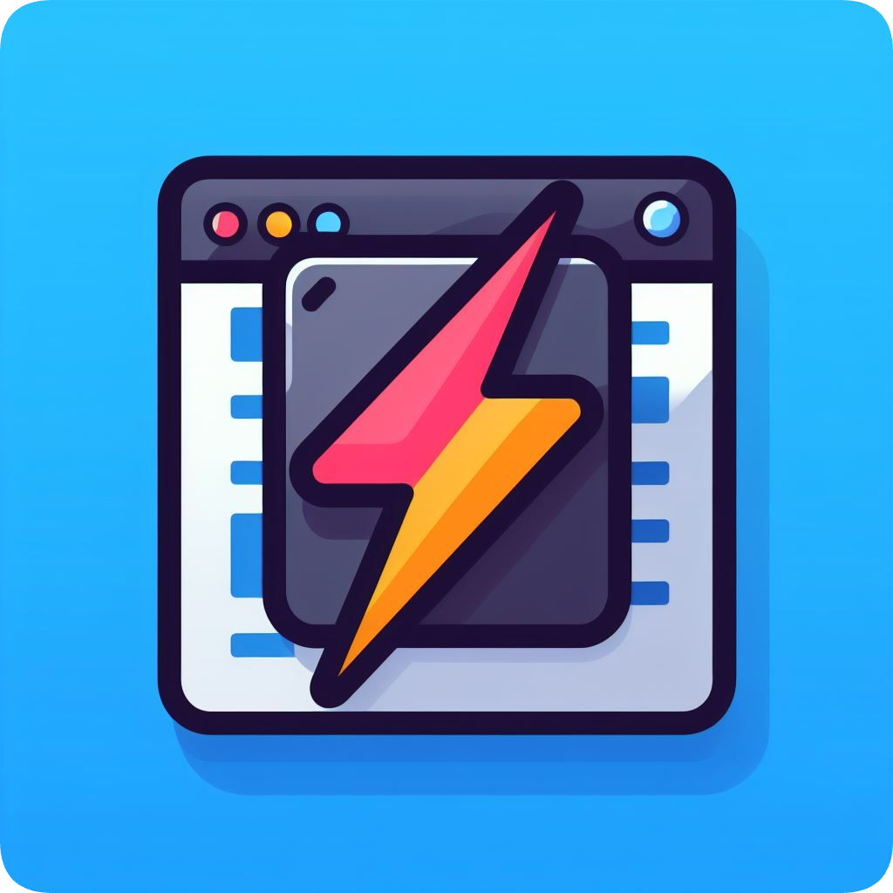
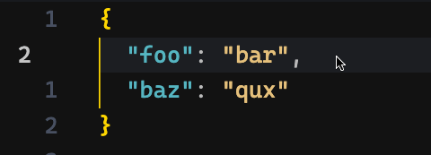

<h2 align="center"><br />Highlight on Copy</h2>
<p align="center"><strong>⚡️📋 Briefly flash and highlight the selected text that has been copied
</strong></p>
<p align=center>
<a href="https://marketplace.visualstudio.com/items?itemName=mguellsegarra.highlight-on-copy"></a>
</p>

<p align=center>

</p>

This is a **VSCode extension** inspired by the [Vim](https://www.vim.org/) plugin **[vim-highlightedyank](https://github.com/machakann/vim-highlightedyank)**
 and the
**[Neovim](https://github.com/neovim/neovim) built-in [highlight yanked region feature](https://github.com/neovim/neovim/pull/12279)**.

## Configuration 🛠️

The extension works out of the box when triggering your default copy to clipboard shortcut (`Ctrl + C`, `Cmd + C`).

If you wish to change the default keybinding, you can do it in your `Keyboard Shortcuts`:

1. Open **Command Palette**.
2. On Windows and Linux, press `Ctrl + Shift + P`. On macOS, press `Cmd + Shift + P`.
3. Search for `Open Keyboard Shortcuts` and search for the `highlightOnCopy.run" command and remap the shortcut to your needs.

Also, you can customize the color and the duration of the highlight with these entries in your `settings.json`:

1. Open **Command Palette**.
2. On Windows and Linux, press `Ctrl + Shift + P`. On macOS, press `Cmd + Shift + P`.
3. Search for `Open User Settings (JSON)` and select it from the list. This command takes you directly to the `settings.json` file where all your settings are defined.
4. You can now add your custom settings for the extension. Add the following and adjust them to your liking.:

```jsonc
{
    "highlightOnCopy.backgroundColor": "rgba(230, 97, 89, 0.7)",
    // by default the foreground text color it's undefined, meaning the actual color won't be modified
    "highlightOnCopy.foregroundColor": "#fff",
    "highlightOnCopy.timeout": 200
}
```

##  License 📄

This project is licensed under the **MIT License** - see the LICENSE file for details.

##  Author 🙋🏽‍♂️

I'm Marc Güell Segarra, a freelance software developer at [Ondori.dev](https://ondori.dev).

## Contributors

A big shout out to:

- David Kincaid ([@DaelonSuzuka](https://github.com/DaelonSuzuka))

##  Buy Me a Coffee ☕

If you found this extension useful, consider **[buying me a coffee](https://buymeacoffee.com/mguellsegarra)!**
